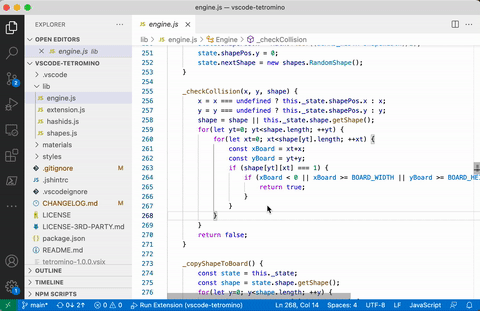

# Tetromino

Another [tetromino][tetromino-wikipedia] falling block game implementation.

Remember the hidden tetromino game in Emacs using the `M-x tetris` command? I
just wanted the same kind of useful tool with VSCode.

## Commands

Open the game using the command palette `Ctrl+Shift+P` (or `Cmd+Shift+P` on
MacOS), then type `Tetromino`.

The current commands to play the game are:

- `left`: move block to left
- `right`: move block to right
- `bottom`: accelerate drop of block, press again to stop the fall
- `up`: rotate block to right
- `space`: rotate block to right
- `x`: rotate block to left
- `p`: pause

## Implementation choices and limitations

This game was originally created for Atom.

According to my understanding, displaying other things than source code text in
VSCode is quite difficult. To achieve that, the simplest way is to use a
WebView. There are two ways two do that:

1. frequently update HTML code, with the business logic code controlled and
   executed by VSCode
2. embed a full HTML web page with business logic code, with a flag telling this
   web page can directly execute JavaScript code

The first option was chosen because it was more similar to the original
Tetromino code that was originally developped for Atom. Moreover, this option
seems more "safe" to me: the stability of VSCode should be guaranteed, and there
should be no possible security issues with the extension.

This choice brings some constraints: the extension can only catch keyboard key
values, but cannot catch a pushdown or pushup key event, which could have been
interesting when making a tetromino piece fall down.

## Contributions

Contributions and bug reports are welcome. Please keep in mind that the whole
idea of the project is to have a minimalist implementation of the tetromino
falling block game, so the game must not evolve too much. It is only for fun,
like the Emacs tetromino game.

## Third party licenses

The game uses the following third party library with their own licenses. Please
check the file `LICENSE-3RD-PARTY.md` for the full license descriptions.

| Name    | License Type | Author       |
| ------- | ------------ | ------------ |
| Hashids | MIT          | Ivan Akimov

[tetromino-wikipedia]: https://en.wikipedia.org/wiki/Tetromino